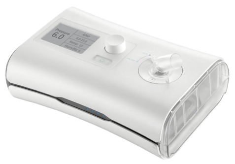
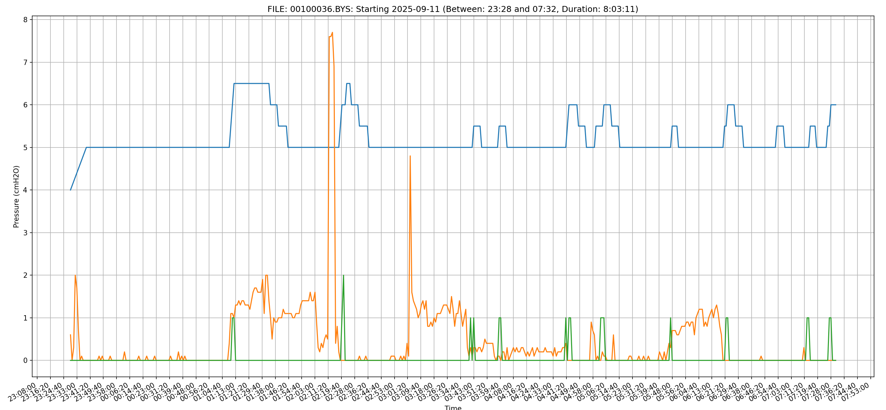

DJMed and Yuwell CPAP Results Reader
====================================

Extract charts like this

WARNING: This is very much a work-in-progress, but it does produce usable charts from sleep data. 

**DISCLAIMER: THIS SHOULD NOT BE USED FOR ANY DIAGNOSTIC PURPOSES**

This parses and presents data from a DJMed/Yuwell CPAP/APAP machine. These machines store data on SD Card in session files ending with the `.bys` extension.

This is a binary grammar. The `010` editor grammar support file is included in the doc directory.

I am still figuring out the binary grammar, particularly the flags in each record, which could be any of the following:

* CSR = Cheyne-Stokes Respiration, heart disease related breathing
* LL = Large Leak
* CA = Central Apnea (found)
* OA = Obstructive Apnea (found)
* H = Hypopnea (found)
* UA = Unknown Apnea
* RE = RERA = Respiratory Effort Related Arousal

Any information about these flags and locations would be very welcome.

Why?
----

Yuwell do provide software for this unit called BreathCare. It is a Windows application. You could probably try to get it working in Wine maybe or whatever the equivalent is on MacOS. This is here to provide some insight into the machine and how things are stored. There are open source CPAP applications like OSCAR which could integrate this data. I believe there is also Home Assitant plugins for some CPAP so that you can control air conditioners and such like based on events. Hopefully this information can help someone.

Installation and Running
------------------------

Right now, this will show charts for all files found in the `data` directory of the repo. This uses `uv` for package management. But it only uses `matplotlib` and `numpy` for the charts.

This was developed using Python 3.14, but it should work in 3.7+. Without the charts, there are no other dependencies on top of Python 3.7+. Just a couple of dataclasses.

1. Clone this repository
2. Install the dependencies with either `uv sync` or `pip install matplotlib numpy`
3. Copy your `.bys` files into the `data` directory directly, no sub-directories
4. Run `python main.py`

I've found these as re-branded units from many companies and drop-shipping establishments. The base manufacturer is Yuwell and this model appears to be a YH550.

BYS File Format
---------------

The file consists of two main sections:

1. File header
2. Log records

The file header contains fixed length fields and is 51 bytes in length. It includes machine settings and a summary of the logs. Most numeric fields are unsigned bytes.

File header
-----------

Dates are formatted with a single byte for year, month, day, hour, minute and seconds.

Years are 2 digit (25=2025 etc.)

Decimal values are represented as the value multiplied by 10

File is little endian

| Offset | Length | Data |
|--------|--------|------|
| 0 | 6 | Log start date/time |
| 6 | 6 | Log end date/time |
| 12 | 1 | *unknown* |
| 13 | 1 | Ramp up time (minutes, integer) |
| 14 | 1 | Initial pressure (Decimal) |
| 15 | 1 | Minimum pressure (Decimal) |
| 16 | 1 | Maximum pressure (Decimal) |
| 17 | 1 | *unknown* |
| 18 | 1 | Humidity setting (integer) |
| 19 | 7 | *unknown* |
| 26 | 1 | Average leak volume (Decimal) |
| 27 | 1 | *unknown* |
| 28 | 1 | Average pressure (Decimal) |
| 29 | 1 | *unknown* |
| 30 | 16 | Product serial number |
| 46 | 2 | Record count |
| 48 | 2 | *unknown* (possibly related to record count) |
| 50 | 1 | Header end marker (0xF9) |

Log Records
-----------

Each record represents a minute of data containing the pressure level and leak level as well as event flags, most of which are currently not known. Each record is 10 bytes in length.

According to the documentation, the file could contain SPo2 and pulse data. Which could be the fields with no data as my unit does not measure either.

| Offset | Length | Data |
|--------|--------|------|
| 0 | 1 | Pressure cmH2O (Decimal) |
| 1 | 1 | *unknown* (No data) |
| 2 | 1 | *unknown* (No data) |
| 3 | 1 | oai (Values seen are 0, 1) |
| 4 | 1 | hi (Values seen are 0, 1, 2) |
| 5 | 1 | cai (Values seen are 0, 1, 2) |
| 6 | 1 | *unknown* (Values seen are 0, 1) |
| 7 | 1 | *unknown* (No data) |
| 8 | 1 | *unknown* (No data) |
| 9 | 1 | Leak volume Lpm (Decimal) |

NOTE: The user manuals for the Yuwell units are included, there are no copyright terms in either documents.