**DISCLAIMER: THIS WORK REPRESENTS A CLEAN ROOM DESIGN OF THE DATA FROM THE YUWELL YH550/YH580 CPAP/APAP MACHINES**

DJMed and Yuwell CPAP Results Reader
====================================

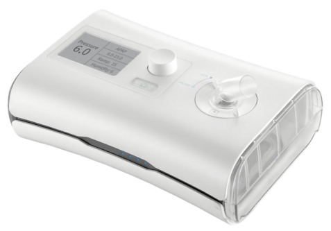
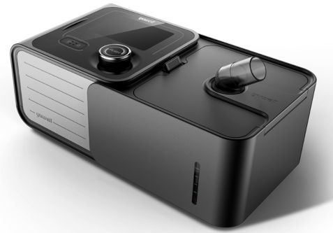

Extract charts like this

WARNING: This is very much a work-in-progress, but it does produce usable charts from sleep data. 

**DISCLAIMER: THIS SHOULD NOT BE USED FOR ANY DIAGNOSTIC PURPOSES**

This parses and presents data from a DJMed/Yuwell CPAP/APAP machine. These machines store data on SD Card in session files ending with the `.bys` extension.

This is a binary grammar. The `010` editor grammar support file is included in the doc directory.

I am still figuring out the binary grammar, particularly the flags in each record, which could be any of the following:

* CSR = Cheyne-Stokes Respiration, heart disease related breathing
* LL = Large Leak (Leaks Lpm information is found in the record structure)
* CA = Central Apnea (found)
* OA = Obstructive Apnea (found)
* H = Hypopnea (found)
* UA = Unknown Apnea
* RE = RERA = Respiratory Effort Related Arousal

Any information about these flags and locations would be very welcome.

As this project stands, the data can be used to product meaningful charts of daily usage.

Why?
----

Currently, this is my clean room testing ground for these machines prior to writing integrations to the [OSCAR](https://www.sleepfiles.com/OSCAR/) open source CPAP analysis software.

Yuwell do provide software for this unit called BreathCare Station. It is a Windows application. You could probably try to get it working in Wine maybe or whatever the equivalent is on MacOS. This is here to provide some insight into the machine and how things are stored. There are open source CPAP applications like OSCAR which could integrate this data. I believe there is also Home Assitant plugins for some CPAP so that you can control air conditioners and such like based on events. Hopefully this information can help someone.

Installation and Running
------------------------

Right now, this will show charts for all files found in the `data` directory of the repo. This uses `uv` for package management. But it only uses `matplotlib` and `numpy` for the charts.

This was developed using Python 3.14, but it should work in 3.7+. Without the charts, there are no other dependencies on top of Python 3.7+. Just a couple of dataclasses.

1. Clone this repository
2. Install the dependencies with either `uv sync` or `pip install matplotlib numpy`
3. Copy your `.bys` files into the `data` directory directly, no sub-directories
4. Run `python yh550.py` for the YH-550 or `python yh580py` for the YH-580

I've found these as re-branded units from many companies and drop-shipping establishments. The base manufacturer is Yuwell and this model appears to be a YH550/YH580.

BYS YH-550 File Format
----------------------

The file consists of two main sections:

1. File header
2. Log records

The file header contains fixed length fields and is 51 bytes in length. It includes machine settings and a summary of the logs. Most numeric fields are unsigned bytes.

File header
-----------

Dates are formatted with a single byte for year, month, day, hour, minute and seconds.

Years are 2 digit (25=2025 etc.)

Decimal values are represented as the value multiplied by 10

File is little endian

| Offset | Length | Data |
|--------|--------|------|
| 0 | 6 | Log start date/time |
| 6 | 6 | Log end date/time |
| 12 | 1 | Mode: 0x00=CPAP, 0x01=APAP |
| 13 | 1 | Ramp up time (minutes, integer) |
| 14 | 1 | Initial pressure (Decimal) |
| 15 | 1 | Minimum pressure (Decimal) |
| 16 | 1 | Maximum pressure (Decimal) |
| 17 | 1 | *unknown* |
| 18 | 1 | Humidity setting (integer) |
| 19 | 7 | *unknown* |
| 26 | 1 | Average leak volume (Decimal) |
| 27 | 1 | *unknown* |
| 28 | 1 | Average pressure (Decimal) |
| 29 | 1 | *unknown* |
| 30 | 16 | Product serial number |
| 46 | 2 | Record count |
| 48 | 2 | *unknown* (possibly related to record count) |
| 50 | 1 | Header end marker (0xF9) |

Log Records
-----------

Each record represents a minute of data containing the pressure level and leak level as well as event flags, most of which are currently not known. Each record is 10 bytes in length.

According to the documentation, the file could contain SPo2 and pulse data. Which could be the fields with no data as my unit does not measure either.

| Offset | Length | Data |
|--------|--------|------|
| 0 | 1 | Pressure cmH2O (Decimal) |
| 1 | 1 | *unknown* (No data) |
| 2 | 1 | *unknown* (No data) |
| 3 | 1 | oai (Values seen are 0, 1) |
| 4 | 1 | hi (Values seen are 0, 1, 2) |
| 5 | 1 | cai (Values seen are 0, 1, 2) |
| 6 | 1 | *unknown* (Values seen are 0, 1) |
| 7 | 1 | *unknown* (No data) |
| 8 | 1 | *unknown* (No data) |
| 9 | 1 | Leak volume Lpm (Decimal) |

NOTE: The user manuals for the Yuwell units are included, there are no copyright terms in either documents.

What Is Missing?
----------------

From what I understand, some Yuwell CPAP/APAP machines do provide the following:

* SPo2 data
* Pulse data

It could be possible that this grammar includes this.

How You Can Help: Binary Grammar Coverage
-----------------------------------------

The binary grammar coverage currently stands at ~81%

There are several bytes in this dataset which currently have no identified data:

With data
* Bytes 49 and 50 of the header record, which appear to be closely related to the record count in bytes 47 and 48, usually off by one
* Byte 7 of the log record, values seen are `[0, 1]` indicating some kind of event although I've not observed matching events in the Breathcare station software

Without data
* Header bytes 18, 20, 28 and 30
* Log record bytes 2, 3, 8 and 9

I have only observed zeroes in these bytes.

BYS YH-580 File Format
----------------------

This file is considerably different to the YH-550 but does share some aspects:

* Date format
* Decimal precisions of 1 decimal place

There are two files written to SD-CARD:
* `YHSD-NEW.BYS`
* `YHSD-OLD.BYS`

These files seem to be capped in file size to 64Kb and log records will overwrite themselves
after a period of time.

All sessions are stored in a single file instead of one session file per file.

The file consists of two main sections:

1. File header
2. Log records

The file header contains fixed length fields and is 3072 (3Kb) bytes in length. It includes machine settings and record count. Most numeric fields are unsigned bytes.

File header
-----------

Dates are formatted with a single byte for year, month, day, hour, minute and seconds.

Years are 2 digit (25=2025 etc.)

Decimal values are represented as the value multiplied by 10

File is little endian

| Offset | Length | Data |
|--------|--------|------|
| 0 | 4 | Magic Number 'AAAA' |
| 4 | 1 | Mode: 0x00=CPAP, 0x01=APAP |
| 5 | 1 | Ramp time in minutes |
| 6 | 1 | Initial pressure (Decimal) |
| 7 | 1 | Pressure settings (Unsure exactly what this is) |
| 8 | 1 | Maximum pressure (Decimal) |
| 9 | 1 | Minimum pressure (Decimal) |
| 10 | 1 | Huimidity level |
| 11 | 1 | Flexible Pressure Support (FPS) Level |
| 12 | 1 | *Unknown* |
| 13 | 2 | Session count |
| 15 | 99 | *Unknown (But full of 0xFF bytes)* |
| 114 | 16 | Model-Serial |
| 130 | 144 | *Unknown (But full of 0xFF bytes)* |
| 274 | 12 | *Unknown (But has some data)* |
| 286 | 2768 | *Unknown, possibly padding (But full of 0xFF bytes)* |

Session Summary Records
-----------------------

The session summary records appear directly after the 3Kb header. Date/time records are identical to the YH-550 from above.

| Offset | Length | Data |
|--------|--------|------|
| 0 | 6 | Session start date/time |
| 6 | 6 | Session end date/time |
| 12 | 1 | Mode: 0x00=CPAP, 0x01=APAP |
| 13| 1 | Ramp time in minutes |
| 14 | 1 | Initial pressure (Decimal) |
| 15 | 1 | Pressure settings (Unsure exactly what this is) |
| 16 | 1 | Maximum pressure (Decimal) |
| 17 | 1 | Minimum pressure (Decimal) |
| 18 | 1 | Huimidity level |
| 19 | 1 | Flexible Pressure Support (FPS) Level |
| 20 | 1 | OAI Count |
| 21 | 1 | HI Count |
| 22 | 1 | CAI Count |
| 23 | 1 | *Unknown* |
| 24 | 1 | Average Pressure (Decimal) |
| 25 | 1 | Average Leak Volume (Decimal) |
| 26 | 2 | Session log lines byte offset from 0x7600 (In big endian for *reasons*) |
| 28 | 1 | *Unknown* |
| 29 | 1 | Minutes in this session (Count of session log lines) |

Session Log Lines
-----------------

Each record represents a minute of data containing the pressure level and leak level as well as event flags. Each record is 7 bytes in length.

All records are offset from position 0x7600 in the file. The session summary record has an offset for the log lines from this point.

From observation, the log lines are overwritten once the record pointer has reached the end of the 64Kb file size. It also appears that the maximum number of log lines per session is 256 as there are allocated gaps between some session of 256 * 7 bytes (record size), for 1792 bytes + an overhead of 2 bytes for a total gap of 1794 bytes. I'm guessing that the device allocates spare room for some session logs in particular situations.

The 7 byte record looks like this, all bytes are accounted for. Log lines are recorded for each minute. OAI, HI and CAI counts are the number of events *in that minute*:

| Offset | Length | Data |
|--------|--------|------|
| 0 | 1 | Leakage volume |
| 1 | 1 | Pressure (Decimal) |
| 2 | 1 | SPo2 |
| 3 | 1 | OAI Count |
| 4 | 1 | HI Count |
| 5 | 1 | Pulse |
| 6 | 1 | CAI Count |

NOTE: The user manuals for the Yuwell units are included, there are no copyright terms in either documents.

What Is Missing?
----------------

From what I understand, some Yuwell CPAP/APAP machines do provide the following:

* SPo2 data (YH-550)
* Pulse data (YH-550)

It could be possible that this grammar includes this.

How You Can Help: Binary Grammar Coverage
-----------------------------------------

At this current stage, I only have datasets for the following Yuwell machines:

* YH550 (BreathCare ECO Auto-CPAP, A/B Models)
* YH580 (BreathCare I Auto-CPAP)

More data from these models is certainly welcome. These datasets do not contain personal information.

Other machines manufactured by Yuwell:

YH350 (BreathCare I Auto-CPAP)
-
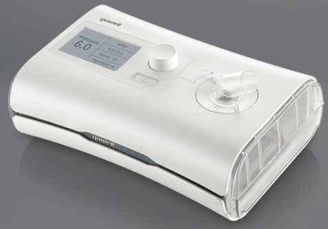

YH360 (BreathCare I Auto-CPAP)
-
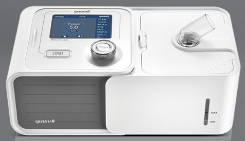

YH450 (BreathCare II Auto-CPAP)
-
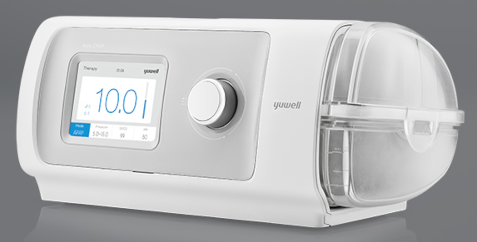

YH480 (BreathCare II Auto-CPAP)
-
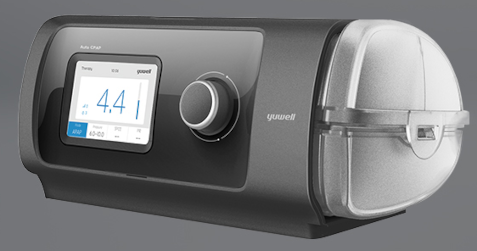

YH680 (BreathCare III Auto-CPAP, A/B Models)
-
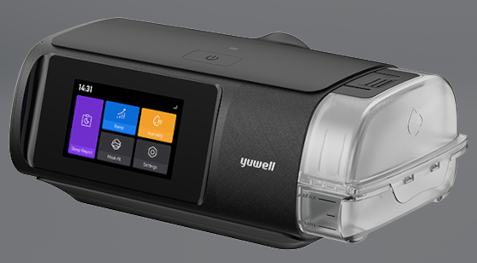

YH690 (BreathCare III Auto-CPAP, A/B Models)
-
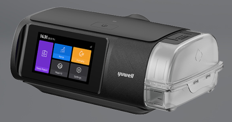

YH720 (BreathCare I Bi-PAP)
-
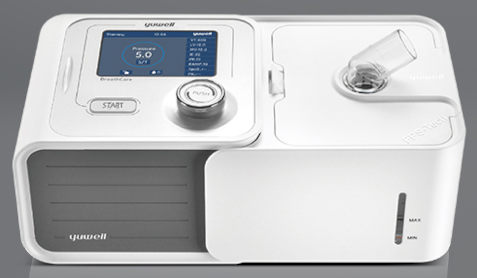

YH725 (BreathCare I Bi-PAP)
-
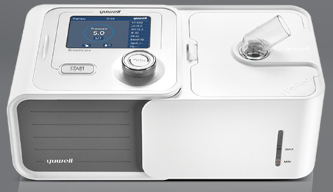

YH730 (BreathCare I Bi-PAP)
-
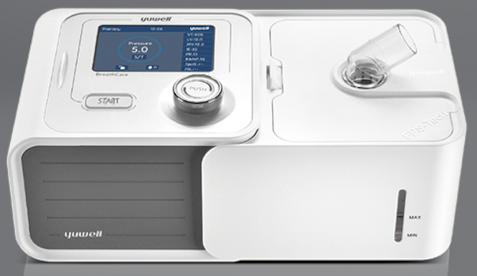

YH820 (BreathCare II Bi-PAP)
-
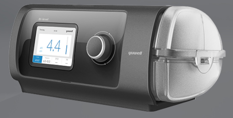

YH825 (BreathCare II Bi-PAP)
-
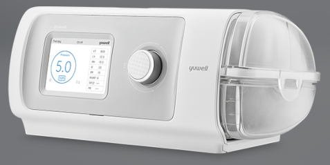

YH830 (BreathCare II Bi-PAP)
-
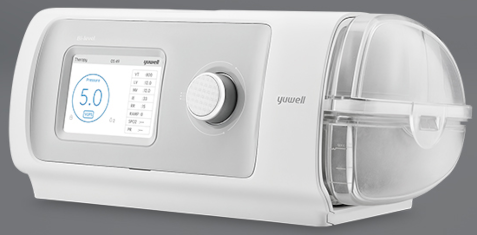

Any data from these machines is very welcome.

I suspect that the YH580 format could match other BreathCare I machines: YH350, YH360, YH720, YH725 and YH730
